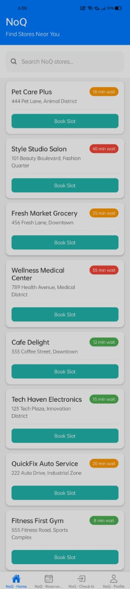
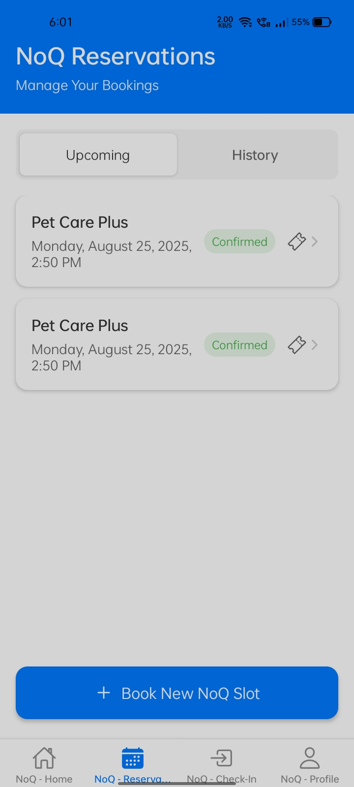
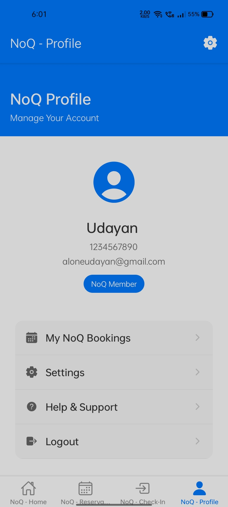

# NoQ - Queue Management System


## 📋 Project Overview
A modern queue management system for businesses to manage customer flow and appointments efficiently.

## 🖼️ Screenshots
<!-- Add your application screenshots below -->
| Signin/Signup | Store Dashboard | Reservations | Profile |
|-------------|-----------------|-------------------|-----------------|
|  |  |  |  |

## ✨ Features
- Real-time queue monitoring
- Store management dashboard
- Mobile-first customer interface
- QR-based check-in system

## 🛠️ Development Setup
```bash
git clone https://github.com/yourusername/noq.git
cd noq
npm install
npm start
```

## 📦 Asset Requirements
```markdown
Place images in `/assets` folder:
- Banner: 1200x600px (PNG/JPG)
- Screenshots: 800x600px (PNG)
- Icons: 256x256px (SVG preferred)
```

## 📄 Documentation
[Technical Architecture](./docs/ARCHITECTURE.md) | [API Reference](./docs/API.md)

## 🤝 Contributing
See [CONTRIBUTING.md](./CONTRIBUTING.md) for development guidelines and code standards.

## 📜 License
MIT Licensed. See [LICENSE.md](./LICENSE.md) for details.
